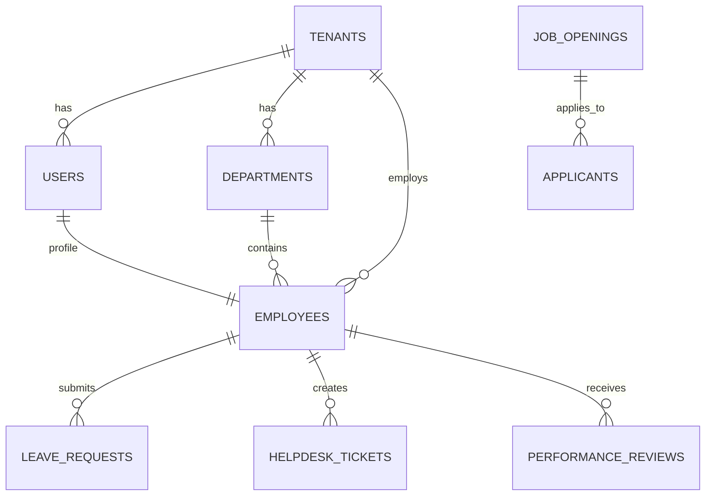

# Database Schema Reference (PostgreSQL)

## 1. Overview
The database uses a multi-tenant architecture where data isolation is enforced at the row level. Every query automatically filters results based on the authenticated user's `tenant_id`.

## 2. Core Tables

### 2.1 `tenants` (Multi-Tenancy Root)
Stores all organization details.
- `id` (UUID, PK): Unique identifier.
- `name` (TEXT): Company name.
- `slug` (TEXT, UNIQUE): Subdomain identifier (e.g., `acme.optitalent.com`).
- `plan` (ENUM): 'Free', 'Startup', 'Enterprise'.
- `status` (ENUM): 'Active', 'Suspended', 'Pending'.
- `created_at` (TIMESTAMPTZ).

### 2.2 `users` (Identity & Roles)
Extensions to Supabase `auth.users`.
- `id` (UUID, PK, FK -> auth.users): Primary identity.
- `tenant_id` (UUID, FK -> tenants): Organization context.
- `email` (TEXT, UNIQUE).
- `full_name` (TEXT).
- `role` (ENUM): 'super-admin', 'admin', 'hr', 'manager', 'employee', etc.

### 2.3 `departments`
Organizational structure.
- `id` (UUID, PK).
- `tenant_id` (UUID, FK -> tenants).
- `name` (TEXT).
- `description` (TEXT).
- **Constraints**: Unique `(tenant_id, name)`.

### 2.4 `employees`
Detailed profile data.
- `id` (UUID, PK).
- `tenant_id` (UUID, FK -> tenants).
- `user_id` (UUID, FK -> users, UNIQUE): Link to login.
- `department_id` (UUID, FK -> departments).
- `manager_id` (UUID, FK -> employees): Reporting hierarchy.
- `job_title` (TEXT).
- `employee_id` (TEXT): Company-specific ID (e.g., EMP001).
- `status` (TEXT): 'Active', 'On Leave', 'Terminated'.

## 3. Operational Modules

### 3.1 Recruitment (ATS)
- **`job_openings`**: Stores open positions (`title`, `status`, `hiring_manager_id`).
- **`applicants`**: Candidate data (`full_name`, `email`, `resume_url`, `status`).
- **`interview_notes`**: Feedback from interviewers.
- **`assessments`**: Configurable tests/quizzes.
- **`assessment_attempts`**: Applicant scores and results.

### 3.2 Leave Management
- **`leave_balances`**: Accrued/Remaining leaves (`sick_leave`, `casual_leave`, `pto`).
- **`leave_requests`**: Employee applications (`start_date`, `end_date`, `type`, `status`).
- **`holidays`**: Company-wide holidays.

### 3.3 Helpdesk (Ticketing)
- **`helpdesk_tickets`**: Issue tracking (`subject`, `priority`, `status`, `category`).
- **`helpdesk_messages`**: Communication thread within a ticket.

### 3.4 Performance & Engagement
- **`performance_reviews`**: Periodic evaluations (`rating`, `goals`, `feedback`).
- **`company_feed_posts`**: Internal social/announcement feed.
- **`bonus_points_history`**: Gamification/Rewards ledger.

### 3.5 Payroll
- **`payroll_history`**: Historical salary records (`pay_period`, `gross`, `net`, `payslip_url`).

## 4. Row-Level Security (RLS) Policies

### 4.1 Global Policy Logic
1.  **Super Admin**: Can access ALL rows in ALL tables.
    ```sql
    (SELECT role FROM public.users WHERE id = auth.uid()) = 'super-admin'
    ```
2.  **Tenant Isolation**: Users can ONLY access rows where `tenant_id` matches their own.
    ```sql
    tenant_id = (SELECT tenant_id FROM public.users WHERE id = auth.uid())
    ```

### 4.2 Specific Access Rules
- **Employees**: Can verify view/edit their own profile (`user_id = auth.uid()`).
- **Managers**: Can view profiles of direct reports (`manager_id = auth.uid()`).
- **HR/Admins**: Can view/edit all employees within their tenant.

## 5. Relationships Diagram (ERD Concept)


